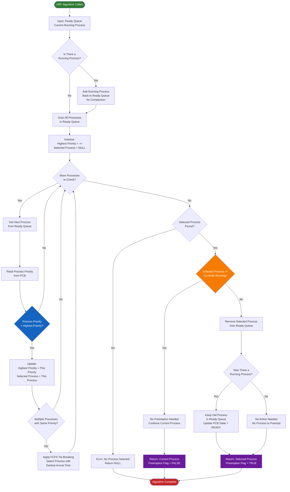

## Key Algorithm Steps:

1. **Input Processing**: Takes the ready queue and current running process as input

2. **Queue Preparation**: If there's a running process, it's added back to the ready queue for comparison (this is what makes it preemptive!)

3. **Priority Scanning**:
   - Iterates through all processes in the ready queue
   - Compares each process's priority value
   - Tracks the process with the highest priority

4. **Tie-Breaking**: If multiple processes have the same highest priority, it applies **FCFS** (First Come First Served) by selecting the one with the earliest arrival time

5. **Preemption Decision**:
   - If the selected process is already running → No preemption needed
   - If a different process has higher priority → Preemption occurs
   - The old process stays in the ready queue with state = READY

6. **Output**: Returns the selected process and a preemption flag indicating whether context switching is needed

This algorithm ensures that at every scheduling decision point, the process with the highest priority gets CPU time, even if it means preempting a currently running lower-priority process!

