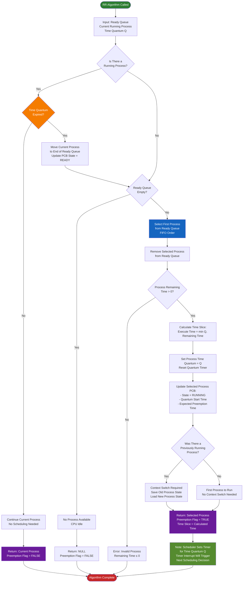

## Key RR Algorithm Features

1. **Time Quantum Check**: First checks if the current process has used up its time quantum
   - If quantum NOT expired → Continue current process (no preemption)
   - If quantum expired → Move to ready queue and select next

2. **FIFO Selection**: Always selects the **first process** from the ready queue (strict FIFO order)
   - No priority comparison needed
   - Fair scheduling - every process gets equal CPU time

3. **Circular Queue Behavior**:
   - When a process's quantum expires, it moves to the **end** of the ready queue
   - Creates a circular/round-robin pattern through all processes

4. **Time Slice Calculation**:
   - Execute time = min(Time Quantum, Remaining Time)
   - Prevents executing more than what's needed if process finishes before quantum

5. **Timer Setup**: The scheduler sets a timer interrupt for the time quantum, which will automatically trigger the next scheduling decision when it expires

6. **Context Switching**: Only occurs when switching between different processes, not when continuing the same one

**Main Difference from HPF**: RR doesn't care about priorities it treats all processes equally and gives each one a fair time slice in rotation. This prevents starvation and ensures good response time for interactive processes!

