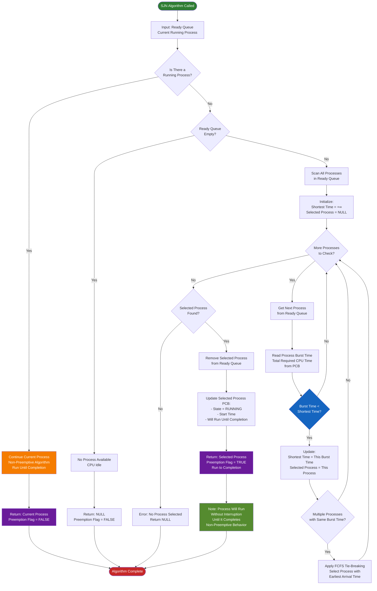

## Key SJN Algorithm Features:

1. **Non-Preemptive Nature**: 
   - If a process is already running → Let it continue until completion
   - No interruption of running processes (major difference from preemptive HPF)

2. **Shortest Burst Time Selection**: 
   - Scans all processes in the ready queue
   - Compares **total burst time** (total required CPU time)
   - Selects the process with the shortest execution time

3. **Tie-Breaking**: If multiple processes have the same burst time, applies **FCFS** by selecting the one with the earliest arrival time

4. **Run to Completion**: Once a process is selected and starts running, it executes without interruption until it finishes

5. **Only Schedules When Idle**: The algorithm only makes a scheduling decision when:
   - No process is currently running (CPU is idle)
   - A process just completed

## Key Differences from Other Algorithms:

- **vs HPF**: Uses burst time instead of priority, and is non-preemptive
- **vs RR**: No time quantum, processes run to completion
- **vs SRTN**: Uses total burst time (not remaining time), and is non-preemptive

**Advantage**: Minimizes average waiting time when you know job lengths in advance

**Disadvantage**: Can cause starvation for long jobs if short jobs keep arriving!

