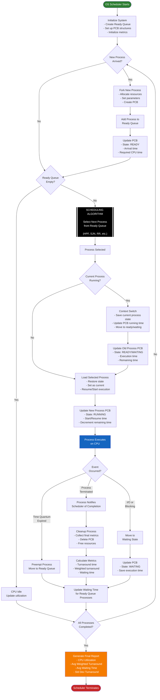

```mermaid

graph TD
    Start([OS Scheduler Starts]) --> Init[Initialize System<br/>- Create Ready Queue<br/>- Set up PCB structures<br/>- Initialize metrics]
    
    Init --> CheckNew{New Process<br/>Arrived?}
    
    CheckNew -->|Yes| Fork[Fork New Process<br/>- Allocate resources<br/>- Set parameters<br/>- Create PCB]
    Fork --> AddQueue[Add Process to<br/>Ready Queue]
    AddQueue --> UpdatePCB1[Update PCB<br/>- State: READY<br/>- Arrival time<br/>- Required CPU time]
    
    CheckNew -->|No| CheckQueue
    UpdatePCB1 --> CheckQueue
    
    CheckQueue{Ready Queue<br/>Empty?}
    CheckQueue -->|Yes| Idle[CPU Idle<br/>Update utilization]
    Idle --> CheckTerminated
    
    CheckQueue -->|No| Algorithm[["SCHEDULING ALGORITHM<br/><br/>Select Next Process<br/>from Ready Queue<br/><br/>(HPF, SJN, RR, etc.)"]]
    
    Algorithm --> Selected[Process Selected]
    
    Selected --> CheckCurrent{Current Process<br/>Running?}
    
    CheckCurrent -->|Yes| ContextSwitch[Context Switch<br/>- Save current process state<br/>- Update PCB running time<br/>- Move to ready/waiting]
    ContextSwitch --> UpdatePCB2[Update Old Process PCB<br/>- State: READY/WAITING<br/>- Execution time<br/>- Remaining time]
    
    CheckCurrent -->|No| LoadNew
    UpdatePCB2 --> LoadNew
    
    LoadNew[Load Selected Process<br/>- Restore state<br/>- Set as current<br/>- Resume/Start execution]
    
    LoadNew --> UpdatePCB3[Update New Process PCB<br/>- State: RUNNING<br/>- Start/Resume time<br/>- Decrement remaining time]
    
    UpdatePCB3 --> Execute[Process Executes<br/>on CPU]
    
    Execute --> CheckEvent{Event<br/>Occurred?}
    
    CheckEvent -->|Time Quantum<br/>Expired| Preempt[Preempt Process<br/>Move to Ready Queue]
    Preempt --> UpdateWait1[Update Waiting Time<br/>for Ready Queue Processes]
    
    CheckEvent -->|Process<br/>Terminated| Notify[Process Notifies<br/>Scheduler of Completion]
    Notify --> Cleanup[Cleanup Process<br/>- Collect final metrics<br/>- Delete PCB<br/>- Free resources]
    Cleanup --> CalcMetrics[Calculate Metrics<br/>- Turnaround time<br/>- Weighted turnaround<br/>- Waiting time]
    CalcMetrics --> UpdateWait1
    
    CheckEvent -->|I/O or<br/>Blocking| Wait[Move to<br/>Waiting State]
    Wait --> UpdatePCB4[Update PCB<br/>- State: WAITING<br/>- Save execution time]
    UpdatePCB4 --> UpdateWait1
    
    UpdateWait1 --> CheckTerminated
    
    CheckTerminated{All Processes<br/>Completed?}
    
    CheckTerminated -->|No| CheckNew
    CheckTerminated -->|Yes| Report[Generate Final Report<br/>- CPU Utilization<br/>- Avg Weighted Turnaround<br/>- Avg Waiting Time<br/>- Std Dev Turnaround]
    
    Report --> End([Scheduler Terminates])
    
    style Algorithm fill:#000,stroke:#fff,stroke-width:4px,color:#fff
    style Start fill:#2e7d32,color:#fff
    style End fill:#c62828,color:#fff
    style Execute fill:#1565c0,color:#fff
    style Report fill:#f57c00,color:#fff

```
