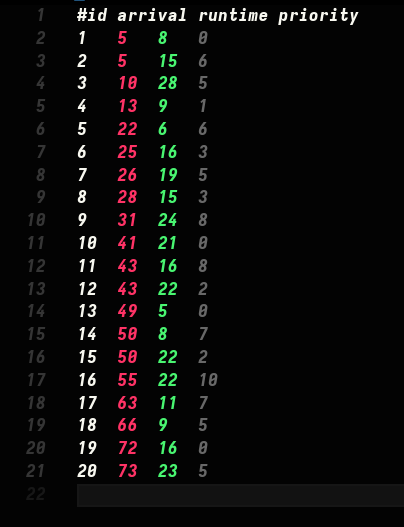

## how to run

you can run the program using `make` provided by `gnumake` package

```bash
make clean build
```
then a folder **if not exist** will be created called `build` where these binaries will be compiled.

```bash
➜  ls
.rwxr-xr-x 1 16k --  clk.out
.rwxr-xr-x 1 16k --  process.out
.rwxr-xr-x 1 17k --  process_generator.out
.rwxr-xr-x 1 23k --  scheduler.out
.rwxr-xr-x 1 16k --  test_generator.out

```

Now we have the programs compiled we will need to execute them in the correct order

first we will excute `test_generator.out` the name can be misleading at first but essentially it will create a number of processes that you can specify `processes` here arn't actual executables they are just virtual in a  so the emulation we are making executes so run

```bash
./test_generator.out
```

it should ask you for a `user input number` so in my case I will say 20


the results are random but in all cases a processes.txt file is created resulting in a similar output to this



after making the random processes, we will take them and run them through any of the scheduling methods we have implemented inside `schedule.out` by using the `process_generator.out`


```bash
./process_generator.out
```

after then a log will be created in `build/scheduler.log` so even if you miss the output of the program the logs will still tail you the simulation and lastly there is a `scheduler.pref`


## Now you have run the simulations and hopefully understood how Scheduling the processes works


<!-- ## headers.h contains clk functions, it should be included anywhere the clock functions are used.

## To get time call:

getClk();

## You can use Makefile to build and run your project

# To compile your project, use the command:
make

# To run your project, use the command:
make run

# If you added a file to your project add it to the build section in the Makefile

# Always start the line with a tab in Makefile, it is its syntax -->
